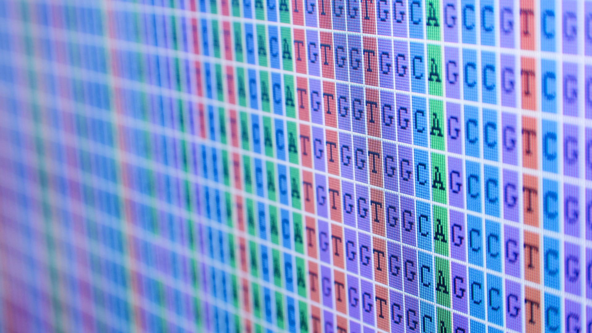

# Computational Genomics Lab

Indiana University, Spring 2016  
Monday & Wednesday, 9:30am - 10:45am, Lindley Hall room 030

With the advent of affordable genome sequencing, research in the life sciences has become increasingly data-intensive.
Basic data management and computing literacy have become vital skills for any biologist or bioinformatician.
In this course we provide a crash course in basic data skills, and then build on these skills to analyze published -omics data, exploring topics such as read mapping, genome annotation, RNA-Seq analysis, and genome assembly.
